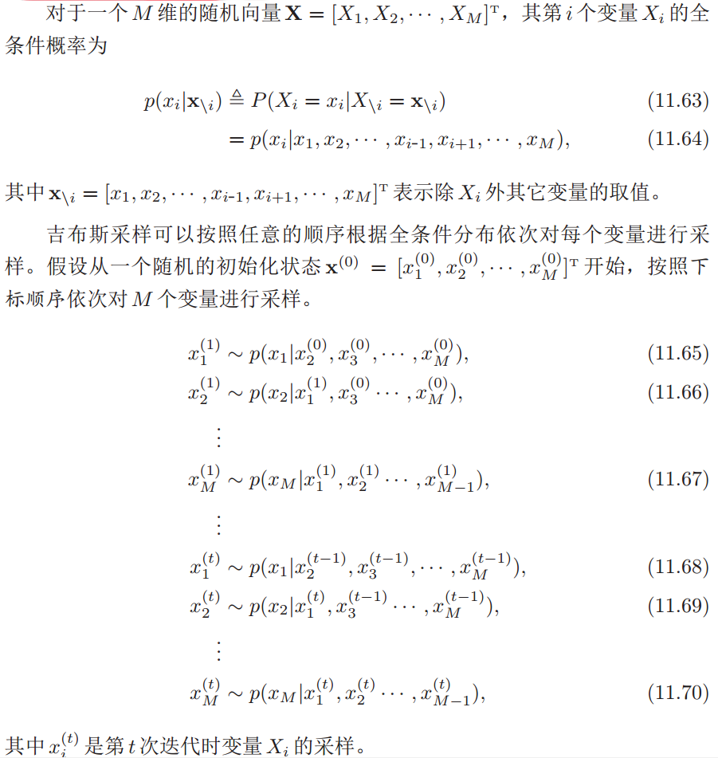
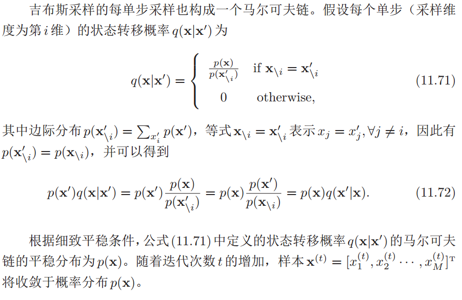
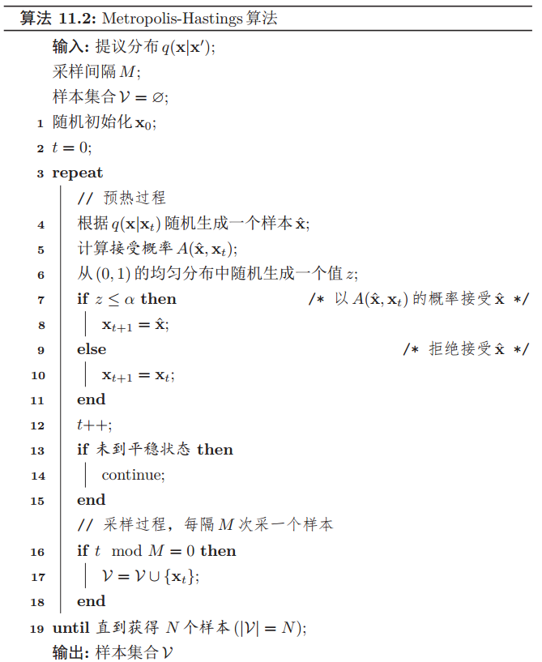

Markov Chain Monte Carlo
================
Lu Yiyun
2020/1/7

  - [1. MCMC](#mcmc)
  - [2. Gibbs抽样](#gibbs抽样)
      - [例1：Ising model的Gibbs采样](#例1ising-model的gibbs采样)
  - [3. Metropolis-Hastings抽样](#metropolis-hastings抽样)
      - [例1：使用MH算法来对Ising model进行采样](#例1使用mh算法来对ising-model进行采样)
      - [例2：提议分布的方差对高斯混合分布的影响](#例2提议分布的方差对高斯混合分布的影响)
  - [4. MCMC的速度和精度](#mcmc的速度和精度)

# 1\. MCMC

**其思想就是构造一个马尔科夫链，让其极限分布是目标分布。然后我们依照此马尔科夫链进行随机游走，得到每个时间点的采样，当过去较长时间后，我们可以近似认为此时在极限分布上进行采样，得到的样本就是从目标分布采样得到的样本。（注意，这些样本不是独立样本！！）**

# 2\. Gibbs抽样



注意到，其采样分布是\(p(x_i|\_x)\)，这称为变量i的全概率公式。但实际上这个变量不一定和所有的其他变量都有关系，比如在概率图模型中，其可能只和一部分有关系，则我们就可以去只用这些变量来计算这个条件分布进行采样。

容易证明，其单步转移概率是满足细致平稳条件的：



## 例1：Ising model的Gibbs采样

Ising
model是一个对物理学中晶格磁性状态进行建模的概率图模型，也是最早使用MCMC方法的模型。但这里为了好理解，我们将其转接为一个图片去噪模型。

考虑一张图片的去噪模型，其干净的像素值\(x_i\in\{-1,+1\}\)，所以我们有以下联合分布：

\[p(x,y)=p(x)p(y|x)\]

我们规定其先验有以下的格式： \[
p(x)=\frac{1}{Z_0}\exp(-E_0(x)) \\
E_0(x)=-\sum_{i=1}^D\sum_{j\in nbr_i} {W_{ij}x_ix_j}
\] 其似然有如下的格式： \[
p(y|x)=\prod_i{p(y_i|x_i)}=\sum_i{\exp(-L_i(x_i))}
\]

所以我们得到后验概率： \[
p(x|y) = \frac{1}{Z}\exp(-E(x)) \\
E(x) = E_0(x)-\sum_i{L_i(x_i)}
\]

以上是总的理解，现在我们简化模型：

  - \(W_{ij}=W_{ji}\)；
  - \(L_i(x_i)=N(x_i,\sigma)\)

<!-- end list -->

``` r
library(tidyverse)

full_conditional_for_i <- function(row_ind, col_ind, img_clr, logits_mat, weight = 1) {
  cimg <- ncol(img_clr)
  rimg <- nrow(img_clr)
  xi <- img_clr[row_ind, col_ind]
  yi <- img_noi[row_ind, col_ind]
  logits <- logits_mat[row_ind, col_ind]
  # eta
  nbr_row_inds <- max(row_ind-1, 1):min(row_ind+1, rimg)
  nbr_col_inds <- max(col_ind-1, 1):min(col_ind+1, cimg)
  eta <- sum(img_clr[row_ind, nbr_col_inds]) + sum(img_clr[nbr_row_inds, col_ind]) - xi * 2
  eta <- 2 * eta - 4
  # p(xi=+1)
  1 / (1 + exp(logits - 2 * weight *eta))
}

gibbs_ising <- function(img_noi, sigma=2, weight=1, steps=100, init = "random") {
  init <- match.arg(init, c("random", "noise_img"))
  ncell <- length(img_noi)
  rimg <- nrow(img_noi)
  cimg <- ncol(img_noi)
  logits_mat <- log(dnorm(img_noi * 2 - 1, 1, sigma ^ 2)) - log(dnorm(img_noi * 2 - 1, -1, sigma ^ 2))
  
  if (init == "random") {
    img_clr <- sample(c(0, 1), ncell, replace = TRUE) %>% matrix(nrow = rimg)
  } else {
    img_clr <- img_noi
  }
  
  save_list <- list()
  for (i in seq_len(steps)) {
    for (rr in seq_len(rimg)) {
      for (cc in seq_len(cimg)) {
        pi <- full_conditional_for_i(rr, cc, img_clr, logits_mat, weight)
        pixel <- sample.int(2, 1, prob = c(1-pi, pi)) - 1
        img_clr[rr, cc] <- pixel
      }
    }
    save_list[[i]] <- img_clr
  }
  save_list
}
```

``` r
plot_img <- function(mat) {
  # ggplot 绘制image
  df <- reshape2::melt(mat)
  df %>% ggplot() + geom_tile(aes(x = Var2, y = -Var1, fill = factor(value))) +
    scale_fill_manual(values = c("white", "black")) +
    theme(panel.grid = element_blank(),
          panel.background = element_blank(),
          legend.position = "none",
          axis.title = element_blank(),
          axis.ticks = element_blank(),
          axis.text = element_blank())
}
add_noise <- function(mat) {
  noise_mat <- mat
  noise_inds <- sample.int(length(mat), ceiling(length(mat) * 0.1))
  noise_mat[noise_inds] <- 1 - img[noise_mat]
  noise_mat
}
library(cowplot)
# 读取图片
mnist <- read_csv("G:/dataset/mnist/mnist_test.csv", col_names = FALSE)[, -1] %>% as.matrix
## Parsed with column specification:
## cols(
##   .default = col_double()
## )
## See spec(...) for full column specifications.
img <- matrix(as.double(mnist[1, ] > 0), nrow = 28, byrow = TRUE)
img_noi <- add_noise(img)
## Warning in noise_mat[noise_inds] <- 1 - img[noise_mat]: number of items to
## replace is not a multiple of replacement length
plot_grid(plot_img(img), plot_img(img_noi))
```

<!-- -->

``` r
# ising去噪
res <- gibbs_ising(img_noi, steps = 100, init = "random", sigma = 1)
plot_grid(plot_img(res[[1]]), plot_img(res[[3]]), plot_img(res[[5]]), plot_img(res[[10]]))
```

<!-- -->

``` r
# 我把结果平均了一下(10之后)
mean_res <- (Reduce("+", res[11:100]) / 90 > 0.5) * 1
plot_img(mean_res)
```

<!-- -->

``` r
# 我发现这个和这个sigma取值有关
imgs <- list()
sigmas <- c(0.1, 1, 2, 3)
for (i in seq_along(sigmas)) {
  res <- gibbs_ising(img_noi, steps = 10, init = "random", sigma = sigmas[i])
  imgs[[i]] <- plot_img(res[[10]])
}
plot_grid(plotlist = imgs)
```

<!-- -->

# 3\. Metropolis-Hastings抽样

我们看以上gibbs采样的过程我们可以比较简单的得到其特点：

1.  一次只能作用于一个维度；
2.  必须要算出全条件概率。

现在介绍的MH算法，是一种更加广泛的算法，其一次可以作用于所有的维度，而且不需要算出确切的概率，只需要知道未归一化的概率密度即可。



其主要思想是利用任意的提议分布作为转移概率，并结合了拒绝采样的思想。Gibbs采样可以看做是其一个特例。

可以证明，其符合细致平稳条件。

当提议分布是对称的时候，接受概率可以被简化，然后这时称此方法为Metropolis算法。

## 例1：使用MH算法来对Ising model进行采样

``` r
library(raster)

logd_ising <- function(img_noi, img_clr, sigma = 2, weight = 1) {
  img_ras <- as.raster(img_clr)
  img_sum <- focal(img_ras, w = matrix(c(0, 1, 0,
                              1, 0, 1,
                              0, 1, 0), nrow = 3, byrow = TRUE), pad = TRUE, padValue = 0)
  img_sum <- as.matrix(img_sum)
  img_score <- sum(img_sum * img_clr) * weight
  
  logit <- sum(dnorm(img_noi, mean = img_clr, sd = sigma ^ 2))
  -img_score - logit
}


mh_ising <- function(img_noi, sigma=2, weight=1, steps=100, normal_sd = 1) {
  ncell <- length(img_noi)
  rimg <- nrow(img_noi)
  cimg <- ncol(img_noi)
  not_accept <- 0
  # 初始化
  img_clr <- sample(c(0, 1), ncell, replace = TRUE) %>% matrix(nrow = rimg)
  
  save_list <- list()
  for (i in seq_len(steps)) {
    # 采样
    img_vec <- as.vector(img_clr)
    proposal <- MASS::mvrnorm(1, img_clr, Sigma = diag(ncell))
    proposal_mat <- matrix(proposal, nrow = rimg)
    # 计算接受率
    q_1_2 <- mvtnorm::dmvnorm(proposal, mean = img_vec)
    q_2_1 <- mvtnorm::dmvnorm(img_vec, mean = proposal)
    logp_1 <- logd_ising(img_noi, img_clr, sigma, weight)
    logp_2 <- logd_ising(img_noi, proposal_mat, sigma, weight)
    accept_rate <- min(exp(logp_2 - logp_2) * q_1_2 / q_2_1, 1)
    
    tmp <- runif(1)
    if (tmp < accept_rate) {
      img_clr <- proposal_mat
    } else {
      not_accept <- not_accept + 1
    }
    save_list[[i]] <- img_clr
  }
  
  list(res = save_list, not_accept_count = not_accept) 
}
```

## 例2：提议分布的方差对高斯混合分布的影响

pass

# 4\. MCMC的速度和精度

pass

对于MCMC，还可以探索的方向：

  - 转移跳跃马尔科夫链；
  - …。
