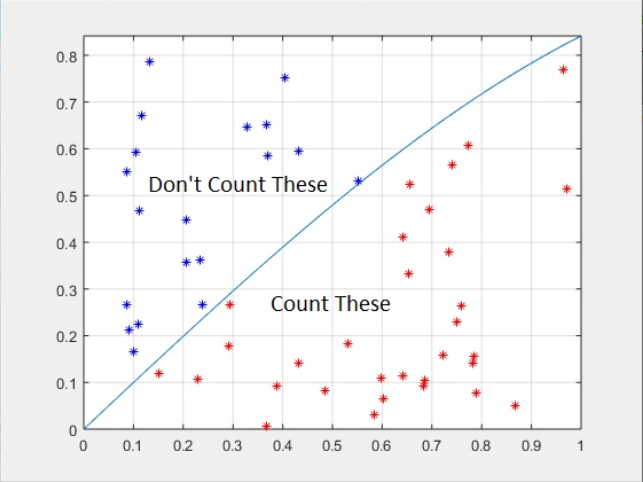
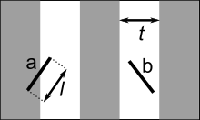
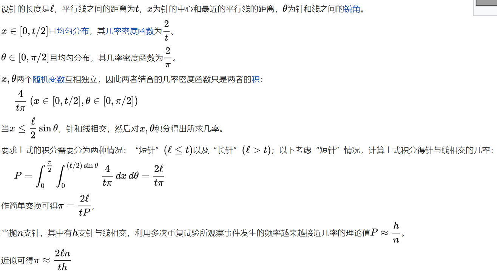
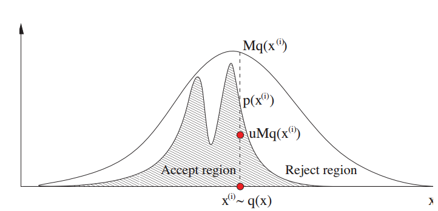
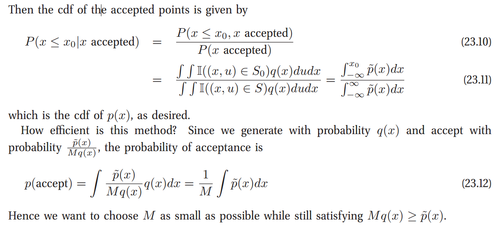
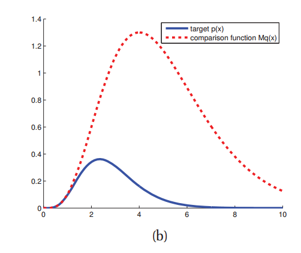
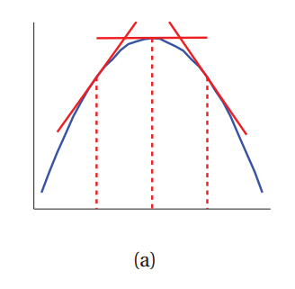
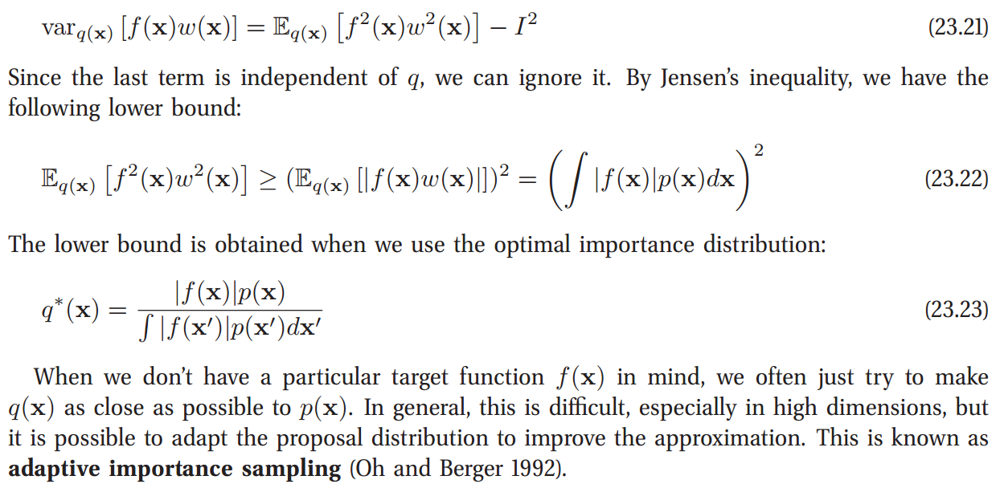

Monte Carlo
================
Lu Yiyun
2020/1/2

  - [1. 定义](#定义)
  - [2. 灵感来源](#灵感来源)
  - [2.1 例1-积分计算](#例1-积分计算)
  - [3. 例2-计算圆周率](#例2-计算圆周率)
      - [3.1 “面积法”](#面积法)
      - [3.2 布丰投针实验](#布丰投针实验)
  - [4. 采样方法](#采样方法)
      - [4.1 逆概率法](#逆概率法)
      - [4.2 “变量代换法”(Box-Muller method)](#变量代换法box-muller-method)
      - [4.3 拒绝采样](#拒绝采样)
      - [4.4 重要性采样](#重要性采样)
  - [5. 问题](#问题)

# 1\. 定义

蒙特卡洛方法，也称为统计模拟方法，指一类通过重复采样来计算数值结果的算法。

# 2\. 灵感来源

以下是依概率收敛的定义： 

**假设上述随机变量\(X\)是一个常数且就是我们需要求的那个确定性数值时，我们是否能够通过随机变量序列\(X_n\)来估算它呢？**

只要我们能够得到一个\(n\)足够大的随机变量\(X_n\)的一个样本，其与我们要求的常数\(X\)间距离差距比\(\epsilon\)大的概率是非常小的。这是我理解的蒙特卡洛方法的数学原理来源。

所以，如果我们需要使用蒙特卡洛方法，就需要以下3个部分：

  - 一个随机分布序列，其中我们可以对其足够后面的元素进行采样；
  - 一个依概率收敛的关系，这个随机分布序列会依概率收敛至一个常数\(X\)；
  - 常数\(X\)和我们要求的值\(X'\)有确定性的函数关系，而且我们知道如何利用\(X\)计算\(X'\)。

上面的3个条件，第一个和第二个是非常难以满足的。

所幸的是，我们知道**大数定理**：


所以前面的3个条件可以更换为：

  - 一个可以进行采样的随机变量\(X\)，其期望为\(\mu\)；
  - 随机变量的期望\(\mu\)和我们要求的值\(X'\)有确定性的函数关系，我们可以利用\(\mu\)计算出\(X'\)。

这样就可以使用以下的步骤来进行估算\(X'\)：

1.  构建一个随机采样器，对随机变量\(X\)进行采样；
2.  计算样本均值\(\overline{X}\)，作为\(\mu\)的估计；
3.  使用\(\overline{X}\)计算\(X'\)。

以上就是我们常说的蒙特卡洛方法的基本过程。

下面我们通过几个例子来具体说明一下。

# 2.1 例1-积分计算

问题：计算\(\int_0^1{\sin(x)dx}\)的值？

我们通过确定性的积分运算可以知道这个值大约是0.4596977。

这个问题使用蒙特卡洛方法是比较简单的，可以总结成下面的图： 

我们对应到前面我们的总结，这里我们进行采样的随机变量是一个伯努利分布，其表示随机落在以上矩形中的点落在曲线下的概率。

我们可以编写一下的函数来计算：

``` r
library(tidyverse)

mc_sin01 <- function(n) {
  # 使用蒙特卡洛方法计算sin积分
  sin1 <- sin(1)
  xs <- runif(n, min = 0, max = 1)
  ys <- runif(n, min = 0, max = sin1)
  sinxs <- sin(xs)
  
  list(
    res = mean(ys < sinxs) * sin1,  # 别忘了乘sin1，因为我们现在的矩形面积不是1
    simu = tibble(x = xs, y = ys, isin = ys < sinxs)
  )
}

# 100次采样的结果
res <- mc_sin01(10000)
res$res
## [1] 0.4570029
head(res$simu)
## # A tibble: 6 x 3
##        x     y isin 
##    <dbl> <dbl> <lgl>
## 1 0.647  0.102 TRUE 
## 2 0.394  0.525 FALSE
## 3 0.619  0.627 FALSE
## 4 0.477  0.582 FALSE
## 5 0.136  0.768 FALSE
## 6 0.0674 0.292 FALSE
```

我们对不同的n重复100次实验，来看估计的精度：

``` r
repeat_simu <- function(func, ns, re_num=100) {
  # 对特定的蒙特卡洛模拟函数进行重复实验
  res_mat <- matrix(0, nrow = re_num, ncol = length(ns))
  for (j in seq_len(length(ns))) {
    n <- ns[j]
    for (i in seq_len(re_num)) {
      res_mat[i, j] <- func(n)$res
    }
  }
  res_mat %>% `colnames<-`(as.character(ns)) %>%  as_tibble
  
}
df <- repeat_simu(mc_sin01, c(100, 1000, 10000, 100000), 100)
df %>% gather() %>% ggplot() + geom_boxplot(aes(key, value)) + 
  geom_hline(yintercept = 1-cos(1), color = "red") + theme_bw()
```

<!-- -->

# 3\. 例2-计算圆周率

## 3.1 “面积法”


想法和上面的是类似的。

``` r
mc_pi1 <- function(n){
  x <- runif(n)
  y <- runif(n)
  dist <- x ^ 2 + y ^ 2
  isin <- dist < 1
  
  list(
    res = mean(isin) * 4,
    simu = tibble(x = x, y = y, isin = isin)
  )
}

res <- mc_pi1(10000)
res$res
## [1] 3.1488
head(res$simu)
## # A tibble: 6 x 3
##        x     y isin 
##    <dbl> <dbl> <lgl>
## 1 0.841  0.106 TRUE 
## 2 0.384  0.603 TRUE 
## 3 0.0707 0.403 TRUE 
## 4 0.690  0.696 TRUE 
## 5 0.915  0.440 FALSE
## 6 0.375  0.439 TRUE
```

同样我们对不同的n重复100次，看其精度:

``` r
df <- repeat_simu(mc_pi1, c(100, 1000, 10000, 100000), 100)
df %>% gather() %>% ggplot() + geom_boxplot(aes(key, value)) + 
  geom_hline(yintercept = pi, color = "red") + theme_bw()
```

<!-- -->

## 3.2 布丰投针实验

这个是一个经典的实验，而且也算是第一次有人提出使用随机性来估算确切性问题的方法。其描述是这样的：



有一个以等距平行线(距离为\(t\))组成的地板，现在随机抛一支长度(\(l\))比木纹之间距离小的针，求针与其中一条木纹相交的概率。这个概率可以表示为
\[P=\frac{2l}{t\pi}\] 则我们可以通过重复抛针实验来得到圆周率的估计值。

证明： 

程序实现：

``` r
boffon_needle <- function(n, l, t) {
  center <- runif(n, 0, t/2)
  angle <- runif(n, 0, pi/2)  # 其实这里用到pi了，这个模拟主要是来实现以下看看效果
  isin <- (sin(angle) * l / 2) > center
  
  list(
    res = 2 * l / (mean(isin) * t),
    simu = tibble(center = center, angle = angle, isin = isin)
  )
}

boffon_needle(10000, 1, 2)$res
## [1] 3.164557
```

我们对上述实验重复看精度：

``` r
res_mat <- matrix(0, nrow = 5*4*100, ncol = 3, dimnames = list(NULL, c("pi", "l", "n")))
ind <- 1
for (k in seq_len(5)) {
  l <- k * 2 - 1
  for (j in seq_len(4)) {
    n <- 10^(j+1)
    for (i in seq_len(100)) {
      res <- boffon_needle(n, l, 10)
      res_mat[ind, 1] <- res$res
      res_mat[ind, 2] <- l
      res_mat[ind, 3] <- n
      ind <- ind + 1
    }
  }
}
res_mat <- as_tibble(res_mat)
res_mat %>% mutate(l = as.factor(l), n = as.factor(n)) %>% 
  ggplot() + geom_boxplot(aes(n, pi, fill = l)) + 
  geom_hline(yintercept = pi, color = "red") + theme_bw()
```

<!-- -->

# 4\. 采样方法

我们可以看到，蒙特卡洛方法的关键是如何进行分布的采样。（上面的都是伯努利分布的例子，使用其他分布的例子可以参照之前参数的bootstrap方法里的Weibull分布抽样）

那么现在关键变成了我们怎么对一些重要的分布进行采样。

**前提：对均匀分布采样是容易的，是提前可以进行的。**

## 4.1 逆概率法

这一类方法在之前进行参数的bootstrap方法时介绍过，其原理是来自于以下定理：


我们现在使用上述逆概率法对指数分布进行采样。

以下是指数分布的分布函数的反函数的计算：


``` r
invprob_expon <- function(n, lambda=1) {
  # 逆概率法进行指数分布采样
  unif_samples <- runif(n)
  -log(1 - unif_samples) / lambda
}
ggplot_expon <- function(a, b, lambda=1) {
  # 绘制正常的概率密度图
  x <- seq(a, b, length.out = 100)
  y <- lambda * exp(-lambda * x)
  geom_line(data = data.frame(x=x, y=y), aes(x, y), colour="red")
}
```

把我们的模拟绘制以下看看

``` r
library(cowplot)
plots <- list()
for (n in c(100, 1000, 10000, 100000)) {
  samples <- invprob_expon(n)
  p <- samples %>% 
    enframe %>% 
    ggplot() + geom_density(aes(value)) +
    ggplot_expon(min(samples), max(samples)) +
    theme_set(theme_bw())
  plots[[as.character(n)]] <- p
}

plot_grid(plotlist = plots, nrow = 2, labels = names(plots))  # cowplot的警告要这么设置theme
```

<!-- -->

## 4.2 “变量代换法”(Box-Muller method)

那现在我们考虑我们能否对正态分布也进行采样呢？

如果也使用逆概率采样法，则我们需要能够计算正态分布的分布函数的反函数：

以下是正态分布的概率密度函数： \[\phi(x)=\frac{1}{\sqrt{2\pi}}e^{\frac{1}{2}x^2}\]
其累计分布函数：
\[\Phi(x)=\frac{1}{\sqrt{2\pi}}\int_{-\infty}^x{e^{-t^2/2}dt}\]
实际上有一类方法是利用error
function进行的，其和累计分布函数有关系\(\Phi(x)=\frac{1}{2}[1+erf(\frac{x}{\sqrt{2}})]\)，但是显然进行这样的函数计算是另外的一个难题，我们是否有其他的方法来进行采样呢？

**大家是否还记得我们如何计算正态分布的概率密度函数的积分是1？？**

我们当时使用的方法是变量代换，而且是使用的2维随机变量的变量代换（极坐标变换）进行计算的。那么我们是否也可以试图利用变量代换来将一个平面上的、2维的均匀分布随机变量映射为一个2维的正态随机变量，而因为正态随机变量的边际分布依然是正态随机变量，所以我们取其中的一个值即可。

这就是**Box-Muller方法**。

其主要过程为：

1.  从\([-1, 1]\)中采两个均匀分布的随机变量\(z_1, z_2\)，将没有位于单位园内的点去掉，\(p(Z)=\frac{1}{\pi}I(is in circle)\)；
2.  计算数值\[x_i=z_i(\frac{-2\ln{r^2}}{r^2})\]，其中\(r^2=z_1^2+z_2^2\)，利用多维随机变量的变换公式（是《概率论与数理统计》第52页定理的推广，是微积分中多重积分换元法的应用）：
    \[p(x_1,x_2)=p(z_1,z_2)|\frac{\partial(z_1,z_2)}{\partial(x_1,x_2)}|=[\frac{1}{\sqrt{2\pi}}\exp(-\frac{1}{2}x_1^2)][\frac{1}{\sqrt{2\pi}}\exp(-\frac{1}{2}x_2^2)]\]

从这里可以看出，这时随机变量符合的是一个2维的独立正态分布，我们取出其中的一个来，就是我们想要的标准正态分布，而对于不是标准的正态分布，则再使用Z变换即可完成。

``` r
boxmuller_normal <- function(n, mu=0, sigma=1) {
  # Box-Muller方法正态分布采样
  n_samples <- 0
  z1 <- c()
  z2 <- c()
  while (n_samples < n) {
    z1i <- runif(2*n, -1, 1)
    z2i <- runif(2*n, -1, 1)
    add_n <- (z1i ^ 2 + z2i ^ 2) < 1
    n_samples <- n_samples + sum(add_n)
    z1 <- c(z1, z1i[add_n])
    z2 <- c(z2, z2i[add_n])
  }
  z1 <- z1[seq_len(n)]
  z2 <- z2[seq_len(n)]
  r2 <- z1 ^ 2 + z2 ^ 2
  xx <- sqrt(-2 * log(r2) / r2)
  x1 <- z1 * xx
  x1 <- x1 * sigma + mu
  # x2 <- z2 * xx
  return(x1)
}

ggplot_normal <- function(a, b, mu=0, sigma=1) {
  # 绘制正常的概率密度图
  x <- seq(a, b, length.out = 100)
  y <- dnorm(x, mean = mu, sd = sigma, log = FALSE)
  geom_line(data = data.frame(x=x, y=y), aes(x, y), colour="red")
}
```

``` r
plots <- list()
for (n in c(100, 1000, 10000, 100000)) {
  samples <- boxmuller_normal(n)
  p <- samples %>% 
    enframe %>% 
    ggplot() + geom_density(aes(value)) +
    ggplot_normal(min(samples), max(samples)) +
    theme_set(theme_bw())
  plots[[as.character(n)]] <- p
}

plot_grid(plotlist = plots, nrow = 2, labels = names(plots))
```

<!-- -->

但上述过程会存在一个问题，我们有一个拒绝采样的过程来完成单位圆均匀分布的采样，这个处理不太优雅，而且这里也不能再使用球面坐标变换进行变换（会差一个\(r\)），所以我去找了一个另外方式的Box-Muller采样。


证明过程：略

``` r
boxmuller_normal2 <- function(n, mu=0, sigma=1) {
  # Box-Muller方法正态分布采样
  z1 <- runif(n)
  z2 <- runif(n)
  r <- sqrt(-2 * log(z1))
  theta <- cos(2 * pi * z2)
  x1 <- r * theta * sigma + mu
  return(x1)
}

plots <- list()
for (n in c(100, 1000, 10000, 100000)) {
  samples <- boxmuller_normal2(n)
  p <- samples %>% 
    enframe %>% 
    ggplot() + geom_density(aes(value)) +
    ggplot_normal(min(samples), max(samples)) +
    theme_set(theme_bw())
  plots[[as.character(n)]] <- p
}

plot_grid(plotlist = plots, nrow = 2, labels = names(plots))
```

<!-- -->

结合乔里斯基分解，Box-Muller方法可以推广至任意多维正态分布。

Box-Muller方法其实代表了一类方法，其利用变量代换的技巧来完成采样（逆概率法可以看做是其一个特例）。

## 4.3 拒绝采样

上述方法需要比较强的数学技巧，而且需要知道采样分布的精确分布函数。如果我们现在要采样的分布是未归一化的密度函数，或者这个分布非常“诡异”，我们难以找到合适的变量代换方法，这时该怎么办？

一种更容易理解的、通用的采样方法称为**拒绝采样**。

其整个思想用一个图就可以表示： 

其采样过程是：

1.  找到一个可以进行采样的proposed分布\(q(x)\)，并保证存在一个正数\(M\)，使得\(Mq(x)\)会整个覆盖目标分布\(p(x)\)；
2.  先对\(q(x)\)进行一次采样；
3.  然后计算接受概率\(p_{accept}=\frac{p(x)}{Mq(x)}\)；
4.  再从\(U(0,1)\)中进行采样\(u\)，如果\(u<p_{accept}\)则保留这个样本，否则丢弃这个样本；
5.  所有接受的样本构成\(p(x)\)的一个采样。

关于其理论证明： 
这里的例子是去进行Gamma分布的采样，Gamma分布的概率密度函数是：
\[Ga(x|\alpha,\lambda)=\frac{1}{\Gamma(\alpha)}x^{\alpha-1}\lambda^{\alpha}\exp(-\lambda x)\]
我们知道，如果有k个独立的参数为\(\lambda\)指数分布随机变量\(X_i\)，则\(Y=X_1+\cdots+X_k\)服从\(Ga(k,\lambda)\)的Gamma分布，我们可以依靠这个trick来得到Gamma分布样本。但如果\(\alpha\)参数不是正数，则以上方法失效。这时我们可以使用拒绝采样，proposed分布就是使用\(\alpha\)为整数的Gamma分布，取\(\lfloor\alpha\rfloor\)。

下面计算\(M\)： 



则我们现在编写这个模拟：

``` r
rejection_gamma <- function(n, alpha, lambda=1) {
  # 为整数alpha采样的gamma采样函数
  gamma_for_integer <- function(n, alpha, lambda) {
    res <- 0
    for (i in seq_len(alpha)) {
      res <- res + rexp(n, lambda)
    }
    res
  }
  alpha_floor <- floor(alpha)
  rejection_ratio <- 0
  if (alpha_floor != alpha) {
    M <- dgamma(alpha - alpha_floor, alpha, lambda) / dgamma(alpha - alpha_floor, alpha_floor, lambda - 1)
    notreject_n <- 0
    all_n <- 0
    res <- c()
    while (notreject_n < n) {
      # 采样gamma1
      samples_i <- gamma_for_integer(n, alpha_floor, lambda)
      # 计算密度
      samples_i_gammaM <- M * dgamma(samples_i, alpha_floor, lambda-1)
      samples_i_gamma <- dgamma(samples_i, alpha, lambda)
      # 计算拒绝与否
      indx <- runif(n)
      not_rejection <- indx <= (samples_i_gamma / samples_i_gammaM)
      # 记录得到的样本和拒绝率
      samples_use <- samples_i[not_rejection]
      res <- c(res, samples_use)
      notreject_n <- notreject_n + sum(not_rejection)
      print(sum(not_rejection))
      all_n <- all_n + n
    }
    rejection_ratio <- (all_n - notreject_n) / all_n
  }
  else {
    res <- gamma_for_integer(n, alpha, lambda)
  }
  list(res = res[seq_len(n)], rejection_ratio = rejection_ratio)
}

rejection_gamma(10, 1.5, 2)  # 有局限性，lambda无法取1
## [1] 7
## [1] 8
## $res
##  [1] 0.1840492 0.3603491 0.3192928 0.2231307 0.4870804 0.1559198 1.0082458
##  [8] 0.2802903 0.1368693 1.0431087
## 
## $rejection_ratio
## [1] 0.25
```

以上只是一个用来理解拒绝采样的demo，其作为gamma分布的采样效率并不高。

### 4.3.1 自适应拒绝采样\*

拒绝采样最重要的是其效率。为了提高其采样效率，有一个自适应的改进，如图。



## 4.4 重要性采样

现在考虑一个特殊的问题（估计一个随机变量的期望）: \[I=E[f]=\int{f(x)p(x)dx}\]

我们随便找一个proposed distribution\(q(x)\)，则我们有以下变换：
\[E[f]=\int{f(x)\frac{p(x)}{q(x)}q(x)dx}\approx\frac{1}{S}\sum_{s=1}^{S}{w_sf(x^s)}=\hat{I}\]

这里的\(w_s=\frac{p(x^s)}{q(x^s)}\)称为**重要性权重**。

根据上面的推导，任何的proposal都可以完成这个任务，但什么样的proposal更好呢？一个自然的指标是最小化\(\hat{I}\)的方差。



注意到，什么时候令Jesen不等式等号成立：随机变量是一个常数，所以我们有23.23的结论。

我们模拟一下使用均匀分布和正态分布作为proposal来计算t分布下\(sin(x)\)的均值：

``` r
importance_mean_gamma <- function(n, proposal="uniform", uniform_scale=c(0, 1)) {
  proposal <- match.arg(proposal, c("uniform", "normal", "t"))
  if (proposal == "t") {
    prosamples <- rt(n, df=1)
    return(mean(sin(prosamples)))
  }
  else if (proposal == "uniform") {
    d_pro_func = function(x) dunif(x, uniform_scale[1], uniform_scale[2])
    r_pro_func = function(x) runif(x, uniform_scale[1], uniform_scale[2])
  }
  else {
    d_pro_func = dnorm
    r_pro_func = rnorm
  }
  prosamples <- r_pro_func(n)
  dpro_prosamples <- d_pro_func(prosamples)
  dtar_prosamples <- dt(prosamples, df=1)
  f_prosamples <- sin(prosamples)
  
  mean(f_prosamples * dtar_prosamples / dpro_prosamples)
}
```

``` r
# res <- list(n = c(), mu = c(), proposal = c())
# for (proposal_ in c("uniform_1", "uniform_10", "normal", "t")) {
#   for (j in seq_len(4)) {
#     n <- 10 ^ (j+1)
#     for (i in seq_len(100)) {
#       if (str_detect(proposal_, "uniform")) {
#         sss <- as.double(strsplit(proposal_, "_")[[1]][2])
#         proposal <- "uniform"
#         uniform_scale <- c(-sss, sss)
#       }
#       else {
#         proposal <- proposal_
#       }
#       one_mean <- importance_mean_gamma(n, proposal, uniform_scale)
#       res[['n']] <- append(res[["n"]], n)
#       res[['mu']] <- append(res[["mu"]], one_mean)
#       res[['proposal']] <- append(res[["proposal"]], proposal_)
#     }
#   }
# }
# 
# res <- as_tibble(res) %>% mutate(n=as.factor(n), proposal=as.factor(proposal))
# res %>% ggplot() + geom_boxplot(aes(n, mu, fill = proposal)) + theme_bw() +
#   scale_y_continuous(limits = c(-1.25, 1.25))
```

# 5\. 问题

以上的采样多是在一维分布上进行的。如果我们使用拒绝采样对一个高维分布进行采样，则根据高维数据的特点，大约其接受率是\(p_{accept}^D\)，其中\(D\)是维数。假设我们有0.99的接受率，安装正常组学数据的维度大约有8000个维度，则我们计算其接受率是1.206581810^{-35}，这样的采样效率是不可能实现一个有效的采样方法的。所以一般在高维数据上单纯的拒绝采样不可行。

高维分布上的采样需要马尔科夫链的助力。

关于蒙特卡洛方法，可以继续探索的方向：

  - 蒙特卡洛方法的估计精度；
  - 自适应拒绝采样方法；
  - particle filtering；
  - 重采样；
  - Rao-Blackwellised particle filtering（RBPF）等。
